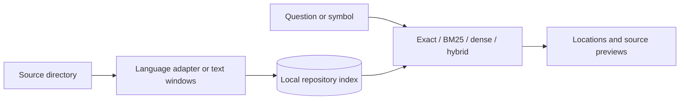

# Code Search Lab

[](https://github.com/ibrahimjspy/code-search-lab/actions/workflows/ci.yml)
[](https://www.python.org/)
[](LICENSE)

**Find code by name, keywords, or meaning.**

Code Search Lab is a local source-retrieval CLI for developers and coding agents.
Point it at a project and get source locations with short, inspectable previews.
Use the standalone CLI, or share a warm service between CLI, MCP and editor clients.

> **Experimental:** a small, inspectable project for exploring code retrieval.
> The included synthetic examples test mechanics; they are not a real-world
> accuracy benchmark or evidence of agent token savings.

## Why this project?

- **One CLI, four retrieval modes:** exact symbols, BM25, code embeddings and hybrid search.
- **Your choice of source:** any Git checkout or ordinary directory; no application-specific defaults.
- **Local inference:** optional embeddings run on your machine, with no source upload for inference.
- **Fresh results:** changed files are reindexed before searching; deleted files disappear.
- **Inspectable evidence:** every result identifies its file, source span and extraction kind.
- **Reproducible experiments:** sealed synthetic labels and comparisons over identical source records.
- **Warm code intelligence:** native file watching, automatic routing and static navigation.

## Try it in a minute

The base CLI needs **Python 3.10+ with SQLite FTS5**. No Python package installation
is needed for Python parsing or generic text search.

```sh
git clone https://github.com/ibrahimjspy/code-search-lab.git
cd code-search-lab

python codesearch search "remove expired cache entries" --repo examples/mini-project
python codesearch symbol TimedCache.get --repo examples/mini-project --json
```

The bundled example is original synthetic code. To search your own project:

```sh
python codesearch search "validate configuration before starting workers" --repo path/to/project --json
```

`--repo` accepts an absolute or relative path. Omit it to search the **current
working directory**. The CLI uses a running service when available, otherwise it
builds or refreshes a standalone index.

## Keep the index and model warm

```sh
python setup.py --typescript --service
python codesearch start --repo path/to/project
python codesearch search "description" --repo path/to/project --require-service --json
python codesearch references Class.method --repo path/to/project --json
python codesearch calls Class.method --repo path/to/project --json
python codesearch status --repo path/to/project
python codesearch stop --repo path/to/project
```

After embedding setup, `start --warm-model` also keeps the encoder and vectors in
memory. File events update changed paths. Queries drain observed events without a
repository scan; use `--sync-path` for known saved files or `--full-sync` for a full
freshness barrier. Periodic reconciliation repairs missed events.

`python codesearch mcp --repo path/to/project` exposes standard MCP tools through
stdio while reusing the same service. The optional [editor adapter](integrations/vscode/README.md)
captures active-file, selection and diagnostic context.

See the [code-intelligence guide](docs/CODE-INTELLIGENCE.md) for routing, confidence
labels, consistency guarantees, editor context and MCP configuration.

## Choose a retrieval mode

| Mode | Use it when | Command |
|---|---|---|
| Exact symbol | You know the class or function name | `python codesearch symbol Class.method --repo path/to/project` |
| Auto **(default)** | Let the service choose exact symbols, BM25 or warm hybrid retrieval | `python codesearch search "question" --repo path/to/project` |
| BM25 | Your question shares words with identifiers, paths or source | Add `--mode bm25` |
| Dense | You want to test matching a description with differently worded code | Add `--mode dense` |
| Hybrid | You want to combine keyword and embedding rankings | Add `--mode hybrid` |
| Regex | You have an explicit pattern | Add `--mode regex` or use a `re:` prefix |

### Optional TypeScript and JavaScript parsing

With Node.js and npm installed:

```sh
python setup.py --typescript
```

This installs the pinned TypeScript parser. Without it, TS/JS files remain
searchable through text windows.

### Optional local embeddings

```sh
python setup.py --embeddings
python codesearch embed --repo path/to/project
python codesearch search "question" --repo path/to/project --mode hybrid --json
```

Setup creates an isolated virtual environment and downloads a pinned
[CodeRankEmbed](https://huggingface.co/nomic-ai/CodeRankEmbed) model, including its
custom Python modeling code. Inference selects CUDA, then MPS, then CPU according
to availability. Model files are shared in the user cache; source indexes and
vectors are isolated by repository.

Initial embedding generation takes time. The shared service keeps the model loaded;
standalone processes reload it. Auto mode uses BM25 for natural-language queries
until a model is resident, then hybrid retrieval. Explicit modes remain available.

## Use it with a coding agent

Any agent with terminal access can invoke the same command. For example, include
this instruction in the agent's project guidance:

```text
To locate code from a behavior description, run:
python /path/to/code-search-lab/codesearch search "<description>" --repo . --json

Read the returned source before making changes. Use the symbol command for a
known qualified name. Fall back to scoped source search if results are insufficient.
```

The tool does not depend on a particular editor, agent provider or framework.
Installing the CLI alone does not automatically configure an agent to use it.

## How it works



1. Discover eligible files and compare content hashes with the last index.
2. Extract declarations where a parser exists; otherwise retain labeled text windows.
3. Store bounded sections, parent symbols, source spans and content identities.
4. Retrieve candidates and, in hybrid mode, combine rankings with reciprocal rank fusion.
5. Return a small result set, avoiding duplicate windows from the same method.

Parser changes invalidate derived records. Embedding cache keys include model
configuration and content, so recycled database IDs cannot return old vectors.
Retrieval reads the source project without modifying it.

See the [algorithm notes](research/SEARCH-ALGORITHMS.md) for the reasoning and sources.

## Language support

| Source | Extraction | Exact-symbol lookup |
|---|---|---|
| Python | Built-in AST | Functions, methods, classes and assignments |
| TypeScript / JavaScript, including JSX variants | Optional TypeScript parser | Parsed declarations |
| Other UTF-8 source and configuration | Bounded text windows | No language-specific symbols |

The retrieval engine is language-independent; structured parser coverage is
incremental. Extraction is syntactic and does not prove dynamic runtime call paths.

## Configuration

| Option | Purpose |
|---|---|
| `--repo PATH` | Source directory; defaults to the current directory |
| `--db PATH` | Override the database location and use standalone operation |
| `--path src/component/` | Restrict results by source-relative path prefix |
| `--mode auto\|bm25\|dense\|hybrid\|regex` | Choose the retrieval strategy |
| `--include-docs` | Include document records |
| `--limit 1..50` | Result count; defaults to 5 |
| `--json` | Structured stdout, with diagnostics on stderr |

Git checkouts use Git's tracked/untracked listing and ignore rules. Ordinary
directories work without Git. Binary and non-UTF-8 files, files over 2 MB, common
dependency/build directories, environment files and key files are skipped.

Add a `.codesearchignore` file for additional exclusions:

```text
generated/
*.min.js
local-notes/
```

These are case-sensitive glob matches against paths or basenames. Directory
prefixes exclude descendants; negation is unsupported. For non-Git directories,
`.gitignore` syntax is not interpreted; use `.codesearchignore` instead.

### Cache locations

Each source directory receives a cache keyed by its normalized absolute path:

- **Windows:** local application-data directory.
- **macOS:** the user's `Library/Caches` directory.
- **Linux:** `XDG_CACHE_HOME`, falling back to the user's `.cache` directory.

Set `CODESEARCH_CACHE_DIR` to change the cache base. By default, indexes, vectors
and evaluation reports stay outside both the source project and this repository.
Caches may contain source text and derived representations; keep them out of commits.

## Development and evaluation

```sh
python setup.py --typescript
python -m unittest test_codesearch test_portability
npm test
python evaluate.py --lexical-only
```

The optional vector-cache tests use NumPy and can run through the virtual
environment's Python with `-m unittest test_semantic`. They do not download a model.
With service dependencies installed, also run `test_intelligence`, `test_service`
and `node test_editor.cjs`. CI covers the tests and lexical evaluation across Windows,
macOS and Linux with Python 3.10 and 3.12; it does not run full embedding inference.

For the embedding comparison, install optional dependencies and run:

```sh
python evaluate.py
```

The [sealed dataset](evaluation/README.md) contains nine original synthetic queries
with source hashes and expected spans. Reports default to the private repository
cache. Source previews are omitted unless `--include-previews` is supplied.
Use `--dataset`, `--repo` and `--output` for your own experiments.

## Project map

| File | Responsibility |
|---|---|
| [`codesearch`](codesearch) | Python CLI |
| [`paths.py`](paths.py) | Source selection and cache isolation |
| [`language_parsers.py`](language_parsers.py) / [`extractor.cjs`](extractor.cjs) | Language adapters |
| [`search_engine.py`](search_engine.py) | Records, freshness, BM25, symbols and rank fusion |
| [`semantic.py`](semantic.py) | Local embedding model and vector cache |
| [`evaluate.py`](evaluate.py) | Sealed-label comparisons and source-span metrics |
| [`service.py`](service.py) / [`intelligence.py`](intelligence.py) | Shared lifetime, native updates and query routing |
| [`navigation.py`](navigation.py) / [`navigation.cjs`](navigation.cjs) | Static definitions, references, imports and calls |
| [`mcp_server.py`](mcp_server.py) | Standard MCP adapter |
| [`editor_context.py`](editor_context.py) | Request-local editor and Git context |

## Roadmap

- Better evidence previews within a fixed context budget.
- Additional parser adapters and appropriately licensed evaluation datasets.
- Measured experiments with reranking and bounded reference expansion.
- Richer dynamic/framework-aware navigation and unsaved-buffer overlays.

Contributions are welcome. Start with [CONTRIBUTING.md](CONTRIBUTING.md), and use a
small synthetic reproduction when reporting a bug.

## License

[MIT](LICENSE). Third-party dependencies and model weights retain their own licenses.
